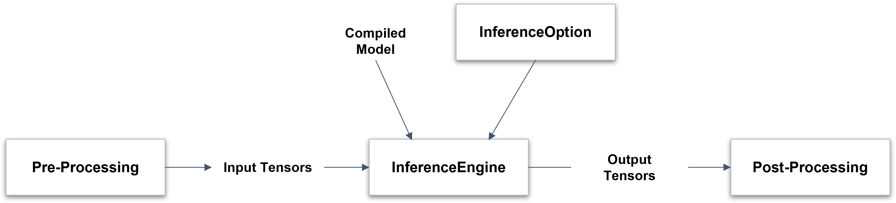
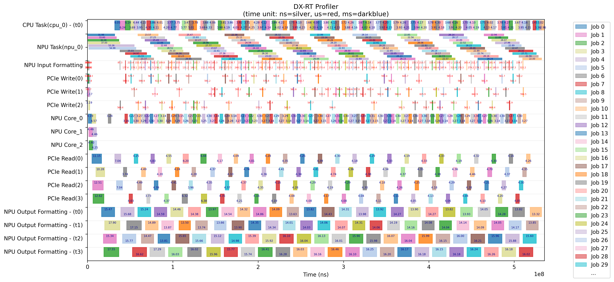

## Model File Format

The original ONNX model is converted by **DX-COM** into the following structure.

```
Model dir.
    └── graph.dxnn
```

- `graph.dxnn`  
  : A unified DEEPX artifact that contains  NPU command data, model metadata, model parameters.  

This file is used directly for inference on DEEPX hardware or simulator.  

---

## Inference Workflow

Here the inference workflow using the DXNN Runtime as follows.  

{ width=600px }

- **1**. Compiled Model and optional InferenceOption are provided to initialize the InferenceEngine.  
- **2**. Pre-processed Input Tensors are passed to the InferenceEngine for inference.  
- **3**. The InferenceEngine produces Output Tensors as a result of the inference.  
- **4**. These outputs are then passed to the Post-Processing stage for interpretation or further action.  


### Prepare the Model  

Choose one of the following options.  

- Use a pre-built model from **DX ModelZoo**  
- Compile an ONNX model into the **DX-RT** format using **DX-COM** (Refer to the **DX-COM User Guide** for details.)  

### Configure Inference Options  

Create a `dxrt::InferenceOption` object to configure runtime settings for the inference engine.  

**Note.** This option is temporarily unsupported in the current version, and will be available in the next release.

### Load the Model into the Inference Engine  

Create a `dxrt::InferenceEngine` instance using the path to the compiled model directory. Hardware resources are automatically initialized during this step.  

If `dxrt::InferenceEngine` is **not** provided, a default option is applied.  

```
auto ie = dxrt::InferenceEngine("yolov5s.dxnn");
auto ie = dxrt::InferenceEngine("yolov5s.dxnn", &option);
```

### Connect Input Tensors  

Prepare input buffers for inference.  

The following example shows how to initialize the buffer with the appropriate size.  

```
std::vector<uint8_t> inputBuf(ie.GetInputSize(), 0);  
```

Refer to **DX-APP User Guide** for practical examples on connecting inference engines to image sources such as cameras or video, along with the preprocessing routines. 

### Inference

**DX-RT** provides both synchronous and asynchronous execution modes for flexible inference handling.  

**1. Run - Synchronous Execution**  
Use the `dxrt::InferenceEngine::Run()` method for blocking, single-core inference.  

```
auto outputs = ie.Run(inputBuf.data());
```

- This method processes input and output on the same thread.  
- This method is suitable for simple and sequential workloads.  


**2. Run - Asynchronous Execution**  

**a.** With `Wait()`  

Use `RunAsync()` to perform the inference in non-blocking mode, and retrieve results later with `Wait()`.  

```
auto jobId = ie.RunAsync(inputBuf.data());
auto outputs = ie.Wait(jobId);
```

- This method is ideal for parallel workloads where inference can run in the background.  
- This method is continuously executed while waiting for the result.  

**b.** With Callback  

Use a callback function to handle output as soon as inference completes. 

```
std::function<int(vector<shared_ptr<dxrt::Tensor>>, void*)> postProcCallBack = \
    [&](vector<shared_ptr<dxrt::Tensor>> outputs, void *arg)
    {
        /* Process output tensors here */
        ... ...
        return 0;
    };
ie.RegisterCallback(postProcCallBack)
```

- The callback is triggered by a background thread after inference.  
- You can pass a custom argument to track input/output pairs.

**Note.** Output data is **only** valid within the callback scope.  

### Process Output Tensors  

Once inference is complete, the output tensors are processed using Tensor APIs and custom post-processing logic. You can find the templates and example code in **DX-APP** to help you implement post-process smoothly.  
As noted earlier, using callbacks allows for more efficient and real-time post-processing.  

---

## Multiple Device Inference

This feature is **not** applicable to single-NPU devices. Basically, the inference engine schedules and manages multiple devices in real time.  
If the inference option is explicitly set, the inference engine may **only** use specific devices during real-time inference for the model.  

---

## Data Format of Device Tensor  
Compiled models use the **NHWC** format by default.  

However, the input tensor formats on the device side may vary depending on the hardware’s processing type.  

**Input Tensor Formats** 

| **Type**      | **Compiled Model Format**    | **Device Format**  | **Data Size** |
|---------------|--------------------|-----------|--------------------|
| `Formatter`   | `[N, H, W, C]`  | `[N, H, W, C]`  | 8-bit  |
| `IM2COL`      | `[N, H, W, C]`  | `[N, H, align64(W*C)]`  | 8-bit  |

- Formatter Type Example: `[1, 3, 224, 224] (NCHW) -> [1, 224, 224, 3] (NHWC)`  
- IM2COL Type Example: `[1, 3, 224, 224] (NCHW) -> [1, 224, 224*3+32] (NH, aligned width x channel)`  


**Output Tensor Formats** 

The output tensor format is also aligned with the NHWC format, but with padding applied for alignment.

 **Type**         | **Compiled Model Format**    | **Device Format**  | 
|---------------|--------------------|----------------------|
| `Aligned NHWC`      | `[N, H, W, C]`  | `[N, H, W, align64(C)]`  |


- Output Example: `[1, 40, 52, 36] (NCHW) -> [1, 52, 36, 40+24]`
   (Channel size is aligned for optimal memory access.)  

Post-processing can be performed directly without converting formats.  
API to convert from device format to **NCHW/NHWC** format will be supported in the next release.  

---

## Profile Application

### Gather Timing Data per Event

You can profile events within your application using the Profiler APIs. Please refer to **Section 8. API reference**.  

Here is a basic usage example. 

```
auto& profiler = dxrt::Profiler::GetInstance();
profiler.Start("1sec");
sleep(1);
profiler.End("1sec");
```

After the application is finished, `profiler.json` is created in the working directory.

### Visualize Profiler Data  

You can visualize the profiling results using the following Python script.  

```
python3 tool/profiler/plot.py --input profiler.json
```

This generates an image file named `profiler.png`, providing a detailed view of runtime event timing for performance analysis. 

{ width=600px }


**Script Usage:** `tool/profiler/plot.py`  

Use this script to draw a timing chart from profiling data generated by **DX-RT**.

```
usage: plot.py [-h] [-i INPUT] [-o OUTPUT] [-s START] [-e END] [-g]
```

Optional Arguments  

- `-h, --help`: Show help message and exit  
- `-i INPUT, --input INPUT`: Input `.json` file to visualize (e.g., `profiler.json`)  
- `-o OUTPUT, --output OUTPUT`: Output image file name to save (e.g., profiler.png)  
- `-s START, --start START`: Starting position (normalized, > 0.0) within the time interval [0.0-1.0]  
- `-e END, --end END`: End position (normalized, < 1.0) within the time interval [0.0-1.0]  
- `-g, --show_gap`: Show time gaps between the start point of each event  

Please refer to usage of `tool/profiler/plot.py`.  

```
usage: plot.py [-h] [-i INPUT] [-o OUTPUT] [-s START] [-e END] [-g]
```

---

## How To Create an Application Using DX-RT
  
This guide provides step-by-step instructions for creating a new CMake project using the **DX-RT** library.

**1. Build the DX-RT Library**   
Before starting, make sure the **DX-RT** library is already built.  

Refer to **Chapter 2. Installation on Linus** and **Chapter 3. Installation on Windows** for detailed build instructions. 

**2. Create a New CMake Project**   
Create a project directory and an initial `CMakeLists.txt` file.  
```

mkdir MyProject
cd MyProject
touch CMakeLists.txt
```

**3. “Hello World” with DX-RT API**  
Create a simple source file (`main.cpp`) that uses a **DX-RT** API.  

```
#include "dxrt/dxrt_api.h"
using namespace std;

int main(int argc, char *argv[])
{
 auto devices = dxrt::CheckDevices();
 cout << "hello, world" << endl;
 return 0;
}
```

**4. Modify CMakeLists.txt**  
Edit the `CMakeLists.txt` file as follows.  

```
cmake_minimum_required(VERSION 3.14)
project(app_template)

set(CMAKE_CXX_STANDARD_REQUIRED "ON")
set(CMAKE_CXX_STANDARD "14")

# Set the DX-RT library installation path (adjust as needed)
set(DXRT_LIB_PATH "/usr/local/lib") 

# Locate the DX-RT library
find_library(DXRT_LIBRARY REQUIRED NAMES dxrt_${CMAKE_SYSTEM_PROCESSOR} PATHS $
{DXRT_LIB_PATH})

# Add executable and link libraries
add_executable(HelloWorld main.cpp)
target_link_libraries(HelloWorld PRIVATE ${DXRT_LIBRARY} protobuf)
```

Replace `/usr/local/lib` with the actual path where the **DX-RT** library is installed.


**5. Build the Project**  
Compile your project using the following commands.  
```
mkdir build
cd build
cmake ..
make
```

**6. Run the Executable**  
After a successful build, run the generated executable.   

```
./HelloWorld
```

You now successfully create and build a CMake project using the **DX-RT** library. 

---
