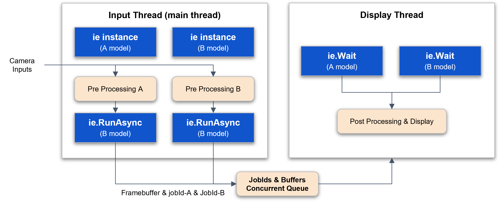
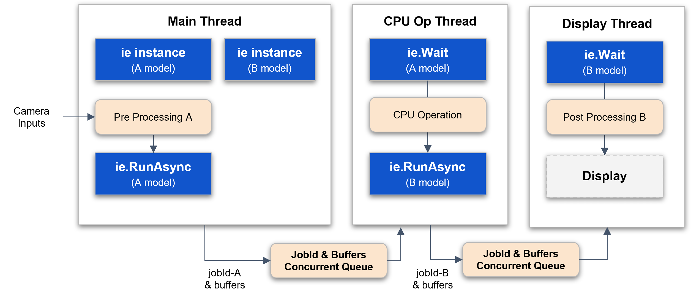

## C++ Tutorials

### Run (Synchronous)

The synchronous Run method uses a single NPU core to perform inference in a blocking manner. It can be configured to utilize multiple NPU cores simultaneously by employing threads to run each core independently.

{ width=200px }

Inference Engine Run synchronous  

- Inference synchronously  
- Use **only** one npu core  

The following is the simplest example of synchronous inference.  

`run_sync_model.cpp`
```
// DX-RT includes
#include "dxrt/dxrt_api.h"
...

int main()
{
    std::string modelPath = "model-path";

    try 
    {
        // create inference engine instance with model
        dxrt::InferenceEngine ie(modelPath);

        // create temporary input buffer for example
        std::vector<uint8_t> inputPtr(ie.GetInputSize(), 0);

        // inference loop
        for(int i = 0; i < 100; ++i)
        {
            // inference synchronously
            // use only one npu core
            auto outputs = ie.Run(inputPtr.data());

            // post processing
            postProcessing(outputs);

        } // for i
    }
    catch(const dxrt::Exception& e)  // exception for inference engine  
    {
        std::cerr << e.what() << " error-code=" << e.code() << std::endl;
        return -1;
    }
    catch(const std::exception& e)
    {
        std::cerr << e.what() << std::endl;
        return -1;
    }

    return 0;
}
```

### RunAsync (Asynchronous)

The asynchronous Run mode is a method that performs inference asynchronously while utilizing multiple NPU cores simultaneously. It can be implemented to maximize NPU resources through a callback function or a thread wait mechanism.

{ width=700px }

Inference Engine RunAsync, Callback, User Argument  

- the outputs are guaranteed to be valid **only** within this callback function  
- processing this callback functions as quickly as possible is beneficial for improving inference performance  
- inference asynchronously, use all npu cores  
- if `device-load >= max-load-value`, this function will block  

The following is an example of asynchronous inference using a callback function. A user argument can be used to synchronize the input with the output of the callback.  

`run_async_model.cpp`
```
// DX-RT includes
#include "dxrt/dxrt_api.h"
...


static std::atomic<int> gCallbackCnt = {0};
static ConcurrentQueue<int> gResultQueue(1);
static std::mutex gCBMutex;

// invoke this function asynchronously after the inference is completed
static int onInferenceCallbackFunc(dxrt::TensorPtrs &outputs, void *userArg)
{
   
    // user data type casting
    std::pair<int, int>* user_data = reinterpret_cast<std::pair<int, int>*>(userArg);

    // post processing with outputs
    // ...
    (void)outputs;
 

    {
        // Mutex locks should be properly adjusted 
        // to ensure that callback functions are thread-safe.
        std::lock_guard<std::mutex> lock(gCBMutex);

        gCallbackCnt ++;

        // end of the loop
        if ( user_data->second == gCallbackCnt.load() ) // check loop count
        {
            gResultQueue.push(gCallbackCnt);
        }
    }

    // delete argument object
    delete user_data;

    return 0;
}


int main(int argc, char* argv[])
{
    ...

    int total_callback_count = 0;

    try 
    {
    
        // create inference engine instance with model
        dxrt::InferenceEngine ie(modelPath);

        // register call back function
        ie.RegisterCallback(onInferenceCallbackFunc);

        // create temporary input buffer for example
        std::vector<uint8_t> inputPtr(ie.GetInputSize(), 0);

        // inference loop
        for(int i = 0; i < loop_count; ++i)
        {
            // user argument
            std::pair<int, int> *userData = new std::pair<int, int>(i, loop_count);

            // inference asynchronously, use all npu cores
            ie.RunAsync(inputPtr.data(), userData);
            
        }

        // wait until all callbacks have been processed
        total_callback_count = gResultQueue.pop();

    }
    catch (const dxrt::Exception& e)
    {
        std::cerr << e.what() << " error-code=" << e.code() << std::endl;
        return -1;
    }
    catch (const std::exception& e)
    {
        std::cerr << e.what() << std::endl;
        return -1;
    }
    catch(...)
    {
        std::cerr << "Exception" << std::endl;
        return -1;
    }
    
    return (total_callback_count == loop_count ? 0 : -1);
}
```

The following is an example where multiple threads start input and inference, and a single callback processes the output.  

Inference Engine RunAsync, Callback, User Argument, Thread  

- the outputs are guaranteed to be valid **only** within this callback function  
- processing this callback functions as quickly as possible is beneficial for improving inference performance  
- inference asynchronously, use all npu cores  
- if `device-load >= max-load-value`, this function will block  

`run_async_model_thread.cpp`
```
// DX-RT includes
#include "dxrt/dxrt_api.h"
...

static const int THREAD_COUNT = 3;
static std::atomic<int> gResultCount = {0};
static std::atomic<int> gTotalCount = {0};
static ConcurrentQueue<int> gResultQueue(1);
static std::mutex gCBMutex;

static int inferenceThreadFunc(dxrt::InferenceEngine& ie, std::vector<uint8_t>& inputPtr, int threadIndex, int loopCount)
{

    // inference loop
    for(int i = 0; i < loopCount; ++i) 
    {
        // user argument
        UserData *userData = new UserData();

        // thread index 
        userData->setThreadIndex(threadIndex);

        // total loop count
        userData->setLoopCount(loopCount);

        // loop index
        userData->setLoopIndex(i);

        try
        {
            // inference asynchronously, use all npu cores
            // if device-load >= max-load-value, this function will block  
            ie.RunAsync(inputPtr.data(), userData);
        }
        catch(const dxrt::Exception& e)
        {
            std::cerr << e.what() << " error-code=" << e.code() << std::endl;
            std::exit(-1);
        }
        catch(const std::exception& e)
        {
            std::cerr << e.what() << std::endl;
            std::exit(-1);
        }

    } // for i

    return 0;

}

// invoke this function asynchronously after the inference is completed
static int onInferenceCallbackFunc(dxrt::TensorPtrs &outputs, void *userArg)
{

    // the outputs are guaranteed to be valid only within this callback function
    // processing this callback functions as quickly as possible is beneficial 
    // for improving inference performance

    // user data type casting
    UserData *user_data = reinterpret_cast<UserData*>(userArg);

    // thread index
    int thread_index = user_data->getThreadIndex();

    // loop index
    int loop_index = user_data->getLoopIndex();

    // post processing
    // transfer outputs to the target thread by thread_index
    // postProcessing(outputs, thread_index);
    (void)outputs;

    
    // result count 
    {
        // Mutex locks should be properly adjusted 
        // to ensure that callback functions are thread-safe.
        std::lock_guard<std::mutex> lock(gCBMutex);

        gResultCount++;
        if ( gResultCount.load() == gTotalCount.load() ) gResultQueue.push(0);
    }

    // delete argument object 
    delete user_data;

    return 0;
}


int main(int argc, char* argv[])
{
    ...

    bool result = false;

    try
    {
        // create inference engine instance with model
        dxrt::InferenceEngine ie(modelPath);

        // register call back function
        ie.RegisterCallback(onInferenceCallbackFunc);    
    
        // create temporary input buffer for example
        std::vector<uint8_t> inputPtr(ie.GetInputSize(), 0);

        gTotalCount.store(loop_count * THREAD_COUNT);

        // thread vector 
        std::vector<std::thread> thread_array;

        for(int i = 0; i < THREAD_COUNT; ++i)
        {
            // create thread
            thread_array.push_back(std::thread(inferenceThreadFunc, std::ref(ie), std::ref(inputPtr), i, loop_count));
        }

        for(auto &t : thread_array)
        {
            t.join();
        } // for t


        // wait until all callbacks have been processed
        gResultQueue.pop();

    }
    catch (const dxrt::Exception& e)
    {
        std::cerr << e.what() << " error-code=" << e.code() << std::endl;
        return -1;
    }
    catch (const std::exception& e)
    {
        std::cerr << e.what() << std::endl;
        return -1;
    }
    catch(...)
    {
        std::cerr << "Exception" << std::endl;
        return -1;
    }
    
    return result ? 0 : -1;
}

```

The following is an example of performing asynchronous inference by creating an inference wait thread. The main thread starts input and inference, and the inference wait thread retrieves the output data corresponding to the input.  

Inference Engine RunAsync, Wait  

- inference asynchronously, use all npu cores  
- if `device-load >= max-load-value`, this function will block  

`run_async_model_wait.cpp`
```
// DX-RT includes
#include "dxrt/dxrt_api.h"
...

// concurrent queue is a thread-safe queue data structure 
// designed to be used in a multi-threaded environment
static ConcurrentQueue<int> gJobIdQueue;

// user thread to wait for the completion of inference 
static int inferenceThreadFunc(dxrt::InferenceEngine& ie, int loopCount)
{
    int count = 0;

    while(...)
    {
        // pop item from queue 
        int jobId = gJobIdQueue.pop();

        try 
        {
            // waiting for the inference to complete by jobId 
            auto outputs = ie.Wait(jobId);

            // post processing 
            postProcessing(outputs);

        }
        catch(const dxrt::Exception& e)  // exception for inference engine 
        {
            std::cerr << e.what() << " error-code=" << e.code() << std::endl;
            std::exit(-1);
        }
        catch(const std::exception& e)
        {
            std::cerr << e.what() << std::endl;
            std::exit(-1);
        }

        // something to do

        count++;
        if ( count >= loopCount ) break;

    } // while

    return 0;
}

int main()
{
    const int LOOP_COUNT = 100;
    std::string modelPath = "model-path";

    try
    {
        // create inference engine instance with model
        dxrt::InferenceEngine ie(modelPath);

        // do not register call back function
        // inferenceEngine.RegisterCallback(onInferenceCallbackFunc);

        // create temporary input buffer for example
        std::vector<uint8_t> inputPtr(ie.GetInputSize(), 0);

        // create thread
        auto t1 = std::thread(inferenceThreadFunc, std::ref(ie), LOOP_COUNT);

        // inference loop
        for(int i = 0; i < LOOP_COUNT; ++i)
        {

            // no need user argument
            // UserData *userData = getUserDataInstanceFromDataPool();

            // inference asynchronously, use all npu cores
            // if device-load >= max-load-value, this function will block
            auto jobId = ie.RunAsync(inputPtr.data());

            // push jobId in global queue variable
            gJobIdQueue.push(jobId);

        } // for i

        t1.join();
    }
    catch(const dxrt::Exception& e)  // exception for inference engine 
    {
        std::cerr << e.what() << " error-code=" << e.code() << std::endl;
        return -1;
    }
    catch(std::exception& e)
    {
        std::cerr << e.what() << std::endl;
        return -1;
    }

    return 0;
}
```

### Run (Batch)
The following is an example of batch inference with multiple inputs and multiple outputs.

`run_batch_model.cpp`

```
int main(int argc, char* argv[])
{
    ...
    
    try
    {

        // create inference engine instance with model
        dxrt::InferenceEngine ie(modelPath);

        // create temporary input buffer for example
        std::vector<uint8_t> inputBuffer(ie.GetInputSize(), 0);

        // input buffer vector
        std::vector<void*> inputBuffers;
        for(int i = 0; i < batch_count; ++i)
        {
            // assigns the same buffer pointer in this example
            inputBuffers.emplace_back(inputBuffer.data());
        }
        
        // output buffer vector
        std::vector<void*> output_buffers(batch_count, 0);

        // create user output buffers
        for(auto& ptr : output_buffers)
        {
            ptr = new uint8_t[ie.GetOutputSize()];
        } // for i

        // batch inference loop
        for(int i = 0; i < loop_count; ++i)
        {
            // inference asynchronously, use all npu core
            auto outputPtrs = ie.Run(inputBuffers, output_buffers);

            // postProcessing(outputs);
            (void)outputPtrs;
        }

        // Deallocated the user's output buffers
        for(auto& ptr : output_buffers)
        {
            delete[] static_cast<uint8_t*>(ptr);
        } // for i

    }
    catch (const dxrt::Exception& e)
    {
        std::cerr << e.what() << " error-code=" << e.code() << std::endl;
        return -1;
    }
    catch (const std::exception& e)
    {
        std::cerr << e.what() << std::endl;
        return -1;
    }
    catch(...)
    {
        std::cerr << "Exception" << std::endl;
        return -1;
    }
    
    return 0;
}
```

### Run & RunAsync

The method for converting a synchronous inference approach using one NPU core into an asynchronous inference approach using multiple NPU cores is as follows. It requires the use of callbacks or threads, as well as the implementation of multiple input buffers to support concurrent operations effectively.

**Converting Run(Sync) to RunAsync**  

- Shift from Single NPU Core to Multiple Cores  
    : Modify the existing Run(Sync) structure, which utilizes a single NPU core, to RunAsync structure capable of leveraging multiple NPU cores simultaneously.  
- Create Multiple Input/Output Buffers  
    : Implement multiple input/output buffers to prevent overwriting. Ensure an appropriate number of buffers are created to support concurrent operations effectively.  
- Introduce Multi-Buffer Concept  
    : To handle simultaneous inference processes, integrate a multi-buffer mechanism. This is essential for managing concurrent inputs and outputs without data conflicts.  
- Asynchronous Inference with Threads or Callbacks  
    : Adjust the code to ensure that inference inputs and outputs operate asynchronously using threads or callbacks for efficient processing.  
- Thread-Safe Data Exchange  
    : For data exchange between threads or callbacks, use a thread-safe queue or structured data mechanisms to avoid race conditions and ensure integrity.  

{ width=700px }

### Inference Option

The following inference options allow you to specify an NPU core for performing inference.

Inference Engine Run, Inference Option  

- Select devices  
    : default devices is `{}`  
    : Choose devices to utilize  
- Select bound option per device  
    : `dxrt::InferenceOption::BOUND_OPTION::NPU_ALL`  
    : `dxrt::InferenceOption::BOUND_OPTION::NPU_0`  
    : `dxrt::InferenceOption::BOUND_OPTION::NPU_1`  
    : `dxrt::InferenceOption::BOUND_OPTION::NPU_2`  
- Use onnx runtime library (`ORT`)  
    : `useORT` on or off  

`run_sync_model_bound.cpp`
```
// DX-RT includes
#include "dxrt/dxrt_api.h"
...

int main()
{
    std::string modelPath = "model-path";

    try
    {

        // select bound option NPU_0 to NPU_2 per device  
        dxrt::InferenceOption op;

        // first device only, default null
        op.devices.push_back(0); // use device 0 
        op.devices.push_back(3); // use device 3 

        // use BOUND_OPTION::NPU_0 only
        op.boundOption = dxrt::InferenceOption::BOUND_OPTION::NPU_0; 

        // use ORT
        op.useORT = false;

        // create inference engine instance with model
        dxrt::InferenceEngine ie(modelPath, op);

        // create temporary input buffer for example 
        std::vector<uint8_t> inputPtr(ie.GetInputSize(), 0);

        // inference loop
        for(int i = 0; i < 100; ++i)
        {
            // input
            uint8_t* inputPtr = readInputData();

            // inference synchronously with boundOption
            // use only one npu core
            // ownership of the outputs is transferred to the user 
            auto outputs = ie.Run(inputPtr.data());

            // post processing
            postProcessing(outputs);

        } // for i
    }
    catch(const dxrt::Exception& e)  // exception for inference engine 
    {
        std::cerr << e.what() << " error-code=" << e.code() << std::endl;
        return -1;
    }
    catch(const std::exception& e)
    {
        std::cerr << e.what() << std::endl;
        return -1;
    }

    return 0;
}
```

### Camera / Inference / Display

The following is an example of a pattern that performs inference using two models on a single camera input and combines the results from both models for display.

{ width=700px }


Multi-model, Async, Wait Thread `(CPU_1 → {NPU_1 + NPU_2} → CPU_2`

`display_async_wait.cpp`
```
// DX-RT includes
#include "dxrt/dxrt_api.h"
...

// input processing main thread with 2 InferenceEngine (asynchronous) 
// display thread 

struct FrameJobId {
    int jobId_A = -1;
    int jobId_B = -1;
    void* frameBuffer = nullptr;
    int loopIndex = -1;
};

static const int BUFFER_POOL_SIZE = 10;
static const int QUEUE_SIZE = 10;

static ConcurrentQueue<FrameJobId> gFrameJobIdQueue(QUEUE_SIZE);
static std::shared_ptr<SimpleCircularBufferPool<uint8_t>> gInputBufferPool_A;
static std::shared_ptr<SimpleCircularBufferPool<uint8_t>> gInputBufferPool_B;
static std::shared_ptr<SimpleCircularBufferPool<uint8_t>> gFrameBufferPool;

// total display count
static std::atomic<int> gTotalDisplayCount = {0};

static int displayThreadFunc(int loopCount, dxrt::InferenceEngine& ieA, dxrt::InferenceEngine& ieB)
{

    while(gTotalDisplayCount.load() < loopCount)
    {
        // consumer framebuffer & jobIds
        auto frameJobId = gFrameJobIdQueue.pop();

        // output data of ieA
        auto outputA = ieA.Wait(frameJobId.jobId_A);

        // output data of ieB
        auto outputB = ieB.Wait(frameJobId.jobId_B);

        // post-processing w/ outputA & outputB
        postProcessing(outputA, outputB);

        gTotalDisplayCount++;

        // display (update framebuffer)
    }

    return 0;
}


int main(int argc, char* argv[])
{
    ...

    try
    {

        // create inference engine instance with model
        dxrt::InferenceEngine ieA(modelPath_A);

        gInputBufferPool_A = std::make_shared<SimpleCircularBufferPool<uint8_t>>(BUFFER_POOL_SIZE, ieA.GetInputSize());
      
        // create inference engine instance with model
        dxrt::InferenceEngine ieB(modelPath_B);

        gInputBufferPool_B = std::make_shared<SimpleCircularBufferPool<uint8_t>>(BUFFER_POOL_SIZE, ieB.GetInputSize());

        const int W = 512, H = 512, CH = 3;
        gFrameBufferPool = std::make_shared<SimpleCircularBufferPool<uint8_t>>(BUFFER_POOL_SIZE, W*H*CH);
    
        // create thread
        std::thread displayThread(displayThreadFunc, loop_count, std::ref(ieA), std::ref(ieB));
        
        // input processing
        for(int i = 0; i < loop_count; ++i)
        {
            uint8_t* frameBuffer = gFrameBufferPool->pointer(); 
            readFrameBuffer(frameBuffer, W, H, CH);

            uint8_t* inputA = gInputBufferPool_A->pointer();
            preProcessing(inputA, frameBuffer);

            uint8_t* inputB = gInputBufferPool_B->pointer();
            preProcessing(inputB, frameBuffer);

            // struct to pass to cpu operation thread 
            FrameJobId frameJobId;

            // start inference of A model
            frameJobId.jobId_A = ieA.RunAsync(inputA);

            // start inference of B model
            frameJobId.jobId_B = ieB.RunAsync(inputB);

            // framebuffer used for input data
            frameJobId.frameBuffer = frameBuffer;
            frameJobId.loopIndex = i;

            // producer frame & jobId
            gFrameJobIdQueue.push(frameJobId);

        }

        displayThread.join();
  
        
    }
    catch (const dxrt::Exception& e)
    {
        std::cerr << e.what() << " error-code=" << e.code() << std::endl;
        return -1;
    }
    catch (const std::exception& e)
    {
        std::cerr << e.what() << std::endl;
        return -1;
    }
    catch(...)
    {
        std::cerr << "Exception" << std::endl;
        return -1;
    }
    
    return 0;
}
```

The following is an example of a pattern that sequentially performs operations using two models and CPU processing. The inference result from Model A is processed through CPU computation and then used as input data for Model B. Finally, the result from Model B is handled for display.

{ width=700px }

Multi-model, Async, Wait Thread `(CPU_1 → NPU_1 → CPU_2 → NPU_2 → CPU_3)`

`display_async_pipe.cpp`
```
// DX-RT includes
#include "dxrt/dxrt_api.h"
...

// input main thread 
// 1 cpu processing thread  
// 1 display thread 

struct FrameJobId {
    int jobId_A = -1;
    int jobId_B = -1;
    uint8_t* inputBufferA;
    uint8_t* inputBufferB;
    void* frameBuffer = nullptr;

    int loopIndex;
};

static const int BUFFER_POOL_SIZE = 10;
static const int QUEUE_SIZE = 10;

static ConcurrentQueue<FrameJobId> gCPUOPQueue(QUEUE_SIZE);
static ConcurrentQueue<FrameJobId> gDisplayQueue(QUEUE_SIZE);
static std::shared_ptr<SimpleCircularBufferPool<uint8_t>> gInputBufferPool_A;
static std::shared_ptr<SimpleCircularBufferPool<uint8_t>> gInputBufferPool_B;
static std::shared_ptr<SimpleCircularBufferPool<uint8_t>> gFrameBufferPool;

// total display count
static std::atomic<int> gTotalDisplayCount = {0};


static int displayThreadFunc(int loopCount, dxrt::InferenceEngine& ieB)
{

    while(gTotalDisplayCount.load() < loopCount)
    {
        // consumer framebuffer & jobIds
        auto frameJobId = gDisplayQueue.pop();

        // output data of ieB
        auto outputB = ieB.Wait(frameJobId.jobId_B);

        // post-processing w/ outputA & outputB
        postProcessingB(outputB);
        
        gTotalDisplayCount++;

        // display (update framebuffer)
        if ( frameJobId.loopIndex == (loopCount - 1)) break;
    }

    return 0;
}

static int cpuOperationThreadFunc(int loopCount, dxrt::InferenceEngine& ieA, dxrt::InferenceEngine& ieB)
{

    while(gTotalDisplayCount.load() < loopCount)
    {
        // consumer framebuffer & jobIds
        auto frameJobIdA = gCPUOPQueue.pop();

        // output data of ieB
        auto outputA = ieA.Wait(frameJobIdA.jobId_A);

        // post-processing w/ outputA
        postProcessingA(frameJobIdA.inputBufferB, outputA);

        FrameJobId frameJobIdB;
        frameJobIdB.loopIndex = frameJobIdA.loopIndex;
        frameJobIdB.jobId_B = ieB.RunAsync(frameJobIdA.inputBufferB);

        gDisplayQueue.push(frameJobIdB);

        // display (update framebuffer)
        if ( frameJobIdA.loopIndex == (loopCount - 1)) break;
    }

    return 0;
}


int main(int argc, char* argv[])
{

    ...

    try
    {

        // create inference engine instance with model
        dxrt::InferenceEngine ieA(modelPath);

        gInputBufferPool_A = std::make_shared<SimpleCircularBufferPool<uint8_t>>(BUFFER_POOL_SIZE, ieA.GetInputSize());
      
        // create inference engine instance with model
        dxrt::InferenceEngine ieB(modelPath);

        gInputBufferPool_B = std::make_shared<SimpleCircularBufferPool<uint8_t>>(BUFFER_POOL_SIZE, ieB.GetInputSize());

        const int W = 512, H = 512, CH = 3;
        gFrameBufferPool = std::make_shared<SimpleCircularBufferPool<uint8_t>>(BUFFER_POOL_SIZE, W*H*CH);
    
        // create thread
        std::thread cpuOperationThread(cpuOperationThreadFunc, loop_count, std::ref(ieA), std::ref(ieB));
        std::thread displayThread(displayThreadFunc, loop_count, std::ref(ieB));
        
        
        // input processing
        for(int i = 0; i < loop_count; ++i)
        {
            uint8_t* frameBuffer = gFrameBufferPool->pointer(); 
            readFrameBuffer(frameBuffer, W, H, CH);

            uint8_t* inputA = gInputBufferPool_A->pointer();
            preProcessing(inputA, frameBuffer);

            // struct to pass to a thread 
            FrameJobId frameJobId;

            frameJobId.inputBufferA = inputA;
            frameJobId.inputBufferB = gInputBufferPool_B->pointer();

            // start inference of A model
            frameJobId.jobId_A = ieA.RunAsync(inputA);

            // framebuffer used for input data
            frameJobId.frameBuffer = frameBuffer;
            frameJobId.loopIndex = i;

            // producer frame & jobId
            gCPUOPQueue.push(frameJobId);

        }

        cpuOperationThread.join();
        displayThread.join();

    }
    catch (const dxrt::Exception& e)
    {
        std::cerr << e.what() << " error-code=" << e.code() << std::endl;
        return -1;
    }
    catch (const std::exception& e)
    {
        std::cerr << e.what() << std::endl;
        return -1;
    }
    catch(...)
    {
        std::cerr << "Exception" << std::endl;
        return -1;
    }
    
    return 0;
}
```

### Exception

The error codes and types of exceptions for error handling are as follows.

```
enum ERROR_CODE {
        DEFAULT = 0x0100,
        FILE_NOT_FOUND,
        NULL_POINTER,
        FILE_IO,
        INVALID_ARGUMENT,
        INVALID_OPERATION,
        INVALID_MODEL,
        MODEL_PARSING,
        SERVICE_IO,
        DEVICE_IO
    };
```

- FileNotFoundException  
- NullPointerException  
- FileIOException  
- InvalidArgumentException  
- InvalidOperationException  
- InvalidModelException  
- ModelParsingException  
- ServiceIOException  
- DeviceIOException  

```
    // try/catch prototype

    try
    {
        // DX-RT APIs ...
    }
    catch(const dxrt::Exception& e)  // exception for inference engine 
    {
        std::cerr << e.what() << " error-code=" << e.code() << std::endl;
        return -1; // or std::exit(-1);
    }
    catch(std::exception& e)
    {
        std::cerr << e.what() << std::endl;
        return -1;  // or std::exit(-1);
    }
```

### Examples

The examples provided earlier are actual code samples that can be executed. Please refer to them for practical use.  

- `display_async_pipe`  
    : An example using `[CPU_1 → {NPU_1 + NPU_2} → CPU_2]` pattern  
- `display_async_wait`  
    : An example using `[CPU_1 → NPU_1 → CPU_2 → NPU_2 → CPU_3]` pattern  
- `run_async_model`  
    : A performance-optimized example using a callback function  
- `run_async_model_thread`  
    : An example using a single inference engine, callback function, and thread  
    : Usage method when there is a single AI model and multiple inputs  
- `run_async_model_wait`  
    : An example using threads and waits  
- `run_sync_model`  
    : An example using a single thread  
- `run_sync_model_thread`  
    : An example running an inference engine on multiple threads  
- `run_sync_model_bound`  
    : An example of specifying an NPU using the bound option  

---
